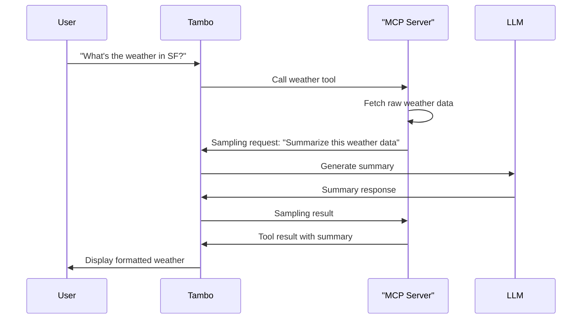

Model Context Protocol provides several powerful features that enable rich interactions between your application and MCP servers. This page explains what each feature is, why it exists, and what the user experience looks like.

For more details on the MCP specification, see the [official MCP documentation](https://modelcontextprotocol.io/docs).

## Tools

**Tools** are functions exposed by MCP servers that the AI can call to perform actions and retrieve data. When a user makes a request that requires external capabilities, the AI automatically calls the appropriate MCP tool.

### What Are Tools?

Tools allow MCP servers to expose executable functions that extend what the AI can do. For example, a Linear MCP server might expose tools like `create_issue`, `list_issues`, or `update_status`. The AI decides when to call these tools based on the conversation context.

### User Experience

From the user's perspective, MCP tools work invisibly:

1. User makes a request: "Show me all open issues"
2. AI recognizes this needs the `list_issues` tool
3. Tool executes and retrieves the data
4. AI formats the results into components
5. User sees the rendered response

The user doesn't manually invoke tools - the AI orchestrates tool calls automatically based on what's needed.

### Rich Content Support

MCP tools automatically support rich content responses. When tools return content arrays (text, images, and other media), Tambo passes them directly to the AI without converting to plain text. This enables tools to seamlessly return images, formatted content, and other rich media.

### Connection Type Support

Tools work with both server-side and client-side MCP connections. Server-side tools execute faster due to direct server-to-server communication, while client-side tools can access local services and browser authentication state.

---

## Prompts

**Prompts** are predefined message templates that MCP servers expose for users to quickly insert into their conversations. They provide standardized starting points for common workflows.

### What Are Prompts?

Prompts are reusable text templates that help users get started with specific tasks. A GitHub MCP server might provide prompts like "Create detailed issue report" or "Review pull request", which expand into well-structured templates when selected.

### User Experience

Users can access prompts in two ways:

**Using the "/" hotkey:**

import { ImageZoom } from "fumadocs-ui/components/image-zoom";

<ImageZoom
  src="/assets/docs/mcp/prompt-slash-selection.png"
  alt="Selecting a prompt with / hotkey"
  width={500}
  height={500}
  style={{ border: "2px solid #e5e7eb", borderRadius: "8px", width: "80%" }}
/>

1. Type "/" at the start of an empty message input
2. A dropdown appears showing all available prompts
3. Type to filter prompts by name
4. Select a prompt to insert its content
5. Edit the inserted content before sending

**Using the prompts button:**

<ImageZoom
  src="/assets/docs/mcp/prompts-button.png"
  alt="Prompts button in message input"
  width={500}
  height={500}
  style={{ border: "2px solid #e5e7eb", borderRadius: "8px", width: "80%" }}
/>

1. Click the document icon (📄) in the message input
2. Browse available prompts organized by MCP server
3. Select a prompt to insert its content

Once inserted, the prompt text appears in the message input and can be edited before sending.

### Prompt Naming

Prompts are always prefixed with the MCP server's `serverKey` (e.g., `linear:new-issue`) to identify which server provides them. This prevents naming conflicts when multiple MCP servers are connected.

### Current Limitations

Prompt parameters are not yet supported. While the MCP specification allows prompts to accept customization parameters, Tambo's current implementation inserts all prompts as-is using their default values. Parameter support is planned for a future release.

### Connection Type Support

Prompts work with both server-side and client-side MCP connections.

---

## Resources

**Resources** are data sources that MCP servers expose, allowing users to reference external content in their conversations. Resources enable dynamic context inclusion without manual copy-pasting.

### What Are Resources?

Resources represent external data that can be referenced in messages. A Linear MCP server might expose issues as resources (`issue://TAM-123`), a file system server might expose files, or a documentation server might expose articles. When a user references a resource, its content is automatically fetched and included in the AI's context.

### User Experience

Users can reference resources in two ways:

**Using the "@" mention:**

<ImageZoom
  src="/assets/docs/mcp/resource-mention-search.png"
  alt="Searching resources with @ mention"
  width={500}
  height={500}
  style={{ border: "2px solid #e5e7eb", borderRadius: "8px", width: "80%" }}
/>

1. Type "@" anywhere in the message input
2. A dropdown appears showing available resources
3. Type to filter resources by name
4. Select a resource to insert its reference as `@resourceUri`

After selecting a resource, it appears as a mention in the message:

<ImageZoom
  src="/assets/docs/mcp/resource-inserted-mention.png"
  alt="Resource inserted via @ mention"
  width={500}
  height={500}
  style={{ border: "2px solid #e5e7eb", borderRadius: "8px", width: "80%" }}
/>

**Using the resources button:**

<ImageZoom
  src="/assets/docs/mcp/resource-button.png"
  alt="Resource button in message input"
  width={500}
  height={500}
  style={{ border: "2px solid #e5e7eb", borderRadius: "8px", width: "80%" }}
/>

When resources are available, an @ icon appears in the message input area. Click it to browse and select resources:

<ImageZoom
  src="/assets/docs/mcp/resource-button-search.png"
  alt="Browsing resources via button"
  width={500}
  height={500}
  style={{ border: "2px solid #e5e7eb", borderRadius: "8px", width: "80%" }}
/>

1. Click the @ button to open the resource picker
2. A dropdown appears showing all available resources
3. Resources are organized by MCP server
4. Type to search and filter resources by name
5. Select a resource to insert its reference into the message input

After selection, the resource appears as a mention in the message (e.g., `@linear:issue://TAM-123`). When the message is sent, the resource content is fetched and included in the AI's context.

### Resource Reference Syntax

Resources are always prefixed to identify which MCP server they come from:

- **Server-side resources:** `@serverKey:serverSidePrefix:resourceUri`
  - Example: `@linear:tambo:issue://TAM-123`
  - Double prefix (client + server)
- **Client-side resources:** `@serverKey:resourceUri`
  - Example: `@linear:issue://TAM-123`
  - Single prefix

The prefix ensures resources from different servers remain distinct even if they use the same URI scheme.

### Server-side vs Client-side Processing

How resources are processed depends on the connection type:

**Server-side resources:**

- The resource reference is sent to Tambo's API
- The server fetches resource content from the MCP server
- Content is injected into the prompt server-side
- Better for resources requiring server authentication or large content

**Client-side resources:**

- The resource is fetched in the browser
- Full content is injected into the prompt client-side
- The complete content is sent to Tambo's API
- Better for resources accessible from the browser or reasonably sized content

### Example Use Cases

- **Issue tracking:** Reference specific issues in conversations
- **File systems:** Include project files for code discussions
- **Knowledge bases:** Pull in documentation articles for context
- **CRM data:** Reference customer profiles in support conversations

### Connection Type Support

Resources work with both server-side and client-side MCP connections, with different fetching strategies as described above.

---

## Elicitations

**Elicitations** allow MCP servers to pause during tool execution and request additional information from users. This creates interactive workflows where tools can ask for confirmation or missing details.

### What Are Elicitations?

Elicitations enable MCP servers to request structured input mid-execution. When a tool needs additional information that wasn't provided initially, it can pause and ask the user for specific details using a dynamically generated form.

### User Experience

When an MCP server requests elicitation:

1. The tool begins executing based on the user's request
2. The tool pauses and sends an elicitation request
3. The message input area transforms into a dynamic form
4. The form displays the server's message and requested fields
5. User fills in the form fields (text, numbers, booleans, enums)
6. User clicks Accept, Decline, or Cancel
7. The tool receives the response and continues execution

The elicitation UI automatically:

- Renders appropriate input fields based on the schema
- Validates user input according to constraints
- Handles the response flow back to the MCP server

### Form Field Types

Elicitations support various input types:

- **Text fields** for string input
- **Number fields** for numeric input
- **Checkboxes** for boolean values
- **Dropdowns** for enum selections
- **Multi-field forms** for complex input

### Response Actions

Users can respond to elicitations in three ways:

- **Accept** - Provide the requested input and continue
- **Decline** - Skip providing input but let the tool continue
- **Cancel** - Abort the entire operation

### Example Use Cases

**Confirmation dialogs:** Ask user to confirm before destructive actions

<ImageZoom
  src="/assets/docs/mcp/elicitation-confirmation.png"
  alt="Elicitation confirmation dialog"
  width={500}
  height={500}
  style={{ border: "2px solid #e5e7eb", borderRadius: "8px", width: "80%" }}
/>

**Multi-field forms:** Request multiple pieces of information at once

<ImageZoom
  src="/assets/docs/mcp/elicitation-multi-field.png"
  alt="Elicitation multi-field form"
  width={500}
  height={500}
  style={{ border: "2px solid #e5e7eb", borderRadius: "8px", width: "80%" }}
/>

**Enum selection:** Let users choose from predefined options

<ImageZoom
  src="/assets/docs/mcp/elicitation-enum.png"
  alt="Elicitation enum selection"
  width={500}
  height={500}
  style={{ border: "2px solid #e5e7eb", borderRadius: "8px", width: "80%" }}
/>

- **Missing information:** Request details not provided in the initial request
- **Progressive disclosure:** Collect information step-by-step as needed

### Connection Type Support

Elicitations work with both server-side and client-side MCP connections.

---

## Sampling

**Sampling** enables MCP servers to request that your application's LLM generate text completions. This allows MCP servers to leverage AI capabilities without implementing their own LLM infrastructure.

### What Is Sampling?

Sampling creates a "sub-conversation" between the MCP server and your application's LLM. The MCP server can send messages to the LLM, receive completions, and use those completions to enhance its tool results. This enables AI-augmented MCP tools.

### User Experience

Sampling happens transparently during tool execution:

1. User makes a request that triggers an MCP tool
2. The tool fetches raw data
3. The tool requests the LLM to analyze or summarize the data (sampling)
4. The LLM generates a response
5. The tool uses the LLM's response in its result
6. User receives the enhanced, AI-processed result

Tambo automatically displays sampling interactions in the UI as expandable dropdowns within tool information panels, showing the messages exchanged between the MCP server and the LLM.

### How It Works

The sampling flow:

### Example Use Cases

- **Data summarization:** Tools fetch detailed data and use the LLM to create concise summaries
- **Content generation:** Tools retrieve specifications and use the LLM to generate code examples
- **Decision making:** Tools gather context and use the LLM to recommend next actions
- **Analysis:** Tools collect information and use the LLM to analyze patterns

### Server-side Only

Sampling currently only works with server-side MCP connections. Client-side MCP servers cannot make sampling requests at this time. This limitation exists because sampling requests need to be processed through Tambo's backend infrastructure for proper security, rate limiting, and LLM access control.

### Connection Type Support

- **Server-side MCP:** ✅ Fully supported
- **Client-side MCP:** ❌ Not yet supported (planned for future)

---

## Feature Support Summary

| Feature          | Server-side  | Client-side      | Description                                         |
| ---------------- | ------------ | ---------------- | --------------------------------------------------- |
| **Tools**        | ✅ Supported | ✅ Supported     | Call functions to perform actions and retrieve data |
| **Prompts**      | ✅ Supported | ✅ Supported     | Insert predefined message templates                 |
| **Resources**    | ✅ Supported | ✅ Supported     | Reference external data sources in conversations    |
| **Elicitations** | ✅ Supported | ✅ Supported     | Request user input during tool execution            |
| **Sampling**     | ✅ Supported | ❌ Not supported | Allow MCP servers to request LLM completions        |

## What's Next

For step-by-step guides on customizing the UI for these features, see the guides section:

import LearnMore from "@/components/learn-more";

<LearnMore
  title="Build Custom Conversation UI"
  description="Learn how to customize the message input and conversation interface"
  href="/guides/build-interfaces/build-chat-interface"
/>
