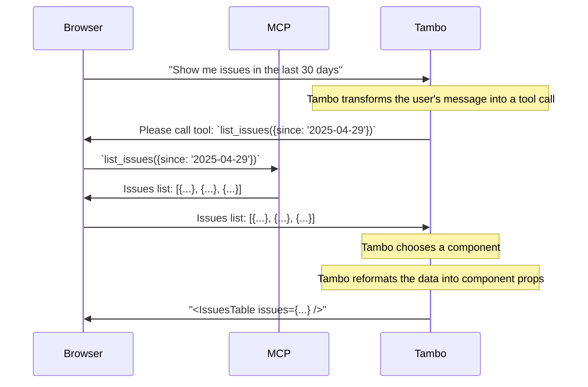

Model Context Protocol (MCP) allows you to give Tambo access to tools, data, and functionality defined by other services. Many popular applications publish MCP servers, and Tambo provides a simple way to connect to them. This lets your users conversationally interact with external services without needing to write integration code yourself.

## What is MCP?

MCP is an open standard that enables AI applications to securely connect to external data sources and tools. It provides a standardized way for AI assistants to:

- **Call tools** - Execute functions to perform actions and retrieve data
- **Access resources** - Reference files, documents, and other data sources
- **Use prompts** - Insert predefined message templates
- **Request input** - Pause for user confirmation or additional information (elicitations)
- **Leverage AI** - Request LLM completions for analysis and generation (sampling)

By using MCP, you can rapidly extend Tambo's capabilities without building custom integrations for every external service.

## Connection Architectures

Tambo supports two ways to connect to MCP servers, each with different architectural tradeoffs:

### Server-side Connections (Recommended)

Server-side MCP connections are configured through the Tambo dashboard and run on Tambo's backend infrastructure. This approach provides the most efficient communication since tools execute via direct server-to-server connections.

<Mermaid
  chart="
sequenceDiagram
    Browser->>Tambo: Show me issues in the last 30 days
    Note over Tambo: Tambo transforms the user's message into a tool call
    Tambo->>MCP: list_issues({since: '2025-04-29'})
    MCP->>Tambo: Issues list: [{...}, {...}, {...}]
    Note over Tambo: Tambo chooses a component
    Note over Tambo: Tambo reformats the data into component props
    Tambo->>Browser: '<IssuesTable issues={...} />'
 "
/>

**Key characteristics:**

- **Authentication:** Supports OAuth-based authentication and custom API key headers
- **Performance:** Most efficient due to direct server-to-server communication
- **Sharing:** MCP servers are shared across all users of your project
- **Configuration:** Managed through the Tambo dashboard
- **Ideal for:** Production applications, shared services, and scenarios requiring OAuth

**Authentication model:** When an MCP server is authenticated via OAuth, the OAuth identity is currently shared across all users of your project. This means every user acts as the same MCP identity when using that server. Only configure servers this way if that shared access level is acceptable for your data and tools. Per-user MCP authentication is planned for the future.

**End-user identity:** Per-user authentication is supported today via the `userToken` prop on `TamboProvider` (an OAuth access token from your auth/SSO provider) — see [User Authentication](/concepts/user-authentication). MCP server auth and end-user auth are independent layers.

### Client-side Connections

Client-side MCP connections run directly in the user's browser, allowing you to leverage the browser's existing authentication state and access to local services.



**Key characteristics:**

- **Authentication:** Leverages the browser's authentication state (cookies, session storage)
- **Performance:** More chatty due to browser-to-Tambo-to-MCP communication
- **Local access:** Can connect to local MCP servers (e.g., `localhost`)
- **Configuration:** Configured in your React application code
- **Ideal for:** Local development, user-specific services, and services behind firewalls

**Authentication note:** There is currently no support for OAuth-based authentication when using client-side MCP connections. The MCP server must be accessible from the browser without additional authentication, or rely on the browser's existing session.

### Comparison

| Feature            | Server-side (Recommended)        | Client-side                       |
| ------------------ | -------------------------------- | --------------------------------- |
| **Performance**    | Fast (direct server connection)  | Slower (browser proxies requests) |
| **Authentication** | OAuth + API keys supported       | Browser session only              |
| **Local servers**  | No (must be internet-accessible) | Yes (can connect to localhost)    |
| **Sharing**        | Shared across all users          | Per-user connections              |
| **Configuration**  | Tambo dashboard                  | React application code            |
| **Best for**       | Production, shared services      | Development, local tools          |

### When to Use Each

**Choose server-side when:**

- You need OAuth authentication
- Performance is critical
- The MCP server should be shared across users
- You want centralized management of connections

**Choose client-side when:**

- Connecting to local development servers
- The MCP server is already accessible from the browser
- Each user needs their own connection
- The service is behind a firewall accessible only to users

## Quick Start

### Server-side Setup

1. Navigate to your [project dashboard](https://tambo.co/dashboard)
2. Click on your project
3. Find the "MCP Servers" section
4. Click "Add MCP Server"
5. Enter the server URL and server type (StreamableHTTP or SSE)
6. If authentication is required, click "Begin Authentication" to start the OAuth flow

Once configured, the MCP servers will be available to all users without any client-side code changes.

### Client-side Setup

> **Dependency note**
>
> The `@tambo-ai/react/mcp` subpath declares `@modelcontextprotocol/sdk`, `zod`, and `zod-to-json-schema` as optional peer dependencies. If you import this subpath, install these packages:
>
> ```bash
> npm install @modelcontextprotocol/sdk@^1.24.0 zod@^4.0.0 zod-to-json-schema@^3.25.0
> ```

Configure MCP servers in your React application:

```tsx
import { TamboProvider } from "@tambo-ai/react";
import { MCPTransport } from "@tambo-ai/react/mcp";

function MyApp() {
  return (
    <TamboProvider
      components={...}
      mcpServers={[
        {
          url: "http://localhost:8123/",
          serverKey: "local", // Optional: stable prefix for namespacing
          customHeaders: {}, // Optional: custom headers like API keys
          transport: MCPTransport.HTTP, // Optional: defaults to HTTP
        },
      ]}
    >
      {/* Your application components */}
    </TamboProvider>
  );
}
```

`TamboProvider` automatically establishes connections to the specified MCP servers and makes their capabilities available to Tambo.

## Server Namespacing

Tambo **always prefixes** MCP capabilities with a `serverKey` to identify which server they come from:

- **Prompts:** `serverKey:promptName` (e.g., `linear:new-issue`)
- **Resources:**
  - Server-side: `serverKey:serverSidePrefix:resourceUri` (e.g., `linear:tambo:issue://TAM-123`)
  - Client-side: `serverKey:resourceUri` (e.g., `linear:issue://TAM-123`)
- **Tools:** `serverKey__toolName` (e.g., `linear__create_issue`)

If you don't specify `serverKey`, Tambo derives one from the server URL hostname (e.g., `https://mcp.linear.app/mcp` becomes `linear`). For predictable behavior across environments, set `serverKey` explicitly.

**Naming guidelines:**

- Avoid `:` and `__` in the `serverKey` (used as separators)
- Prefer letters, numbers, `_`, and `-`
- Use environment-specific keys in multi-environment setups (e.g., `linear-staging`)

## Rich Content Support

MCP tools automatically support rich content responses. When MCP servers return content arrays (text, images, and other media types), Tambo automatically passes them through to the AI without converting them to plain text. This means MCP tools can seamlessly return images, formatted content, and other rich media.

If you're building custom tools that need similar capabilities, you can use the `transformToContent` parameter when registering tools. [Learn more about returning rich content from tools](/guides/take-actions/register-tools#return-rich-content-optional).

## What's Next

import LearnMore from "@/components/learn-more";

<LearnMore
  title="MCP Features"
  description="Learn about tools, prompts, resources, elicitations, and sampling"
  href="/concepts/model-context-protocol/features"
/>
